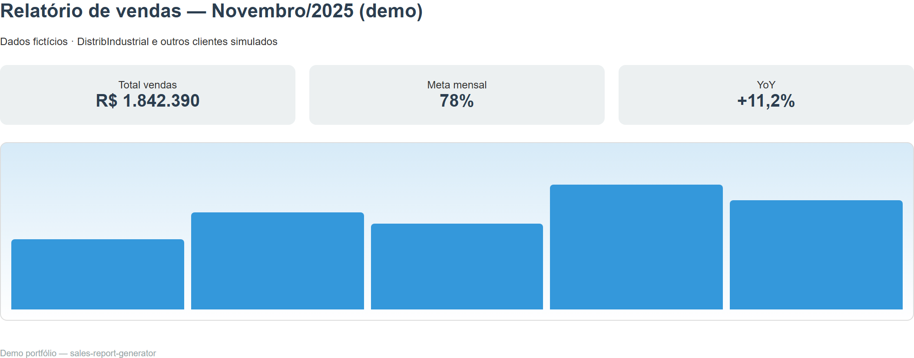

# sales-report-generator


App desktop (CustomTkinter) que gera relatórios **PDF/HTML** de vendas a partir de Excel consolidado.

## Problema que resolve

Fechamento comercial em B2B industrial costuma depender de exports do ERP e planilhas manuais. Esta ferramenta lê o Excel, calcula KPIs (Pareto, mapa por UF, YoY, qualidade de dados) e entrega relatório pronto para reunião — sem depender de BI para rotinas mensais.

## Screenshot



## Stack

Python · CustomTkinter · pandas · matplotlib · Jinja2 · WeasyPrint · openpyxl

## Como rodar

```powershell
python -m venv .venv
.\.venv\Scripts\Activate.ps1
pip install -r requirements.txt
python gerar_relatorio.py
```

Demo: use `data/sample_data.xlsx` na aba **Relatório de Período**.

## Modos

| Aba | Saída |
|-----|--------|
| Período | KPIs, gráficos, mapa UF, resumo executivo |
| Comparativo | Dois períodos + churn opcional |
| Anual / Comparativo anual | Visão do ano |
| Qualidade de dados | HTML com inconsistências |

## Configuração

Copie `.env.example` → `.env`:

| Variável | Descrição |
|----------|-----------|
| `MONTHLY_SALES_TARGET` | Meta mensal (R$) no resumo executivo |
| `APP_CONFIG_DIR` | Pasta em `%APPDATA%` para settings |

## Estrutura

| Arquivo | Função |
|---------|--------|
| `gerar_relatorio.py` | Interface (abas, botões) |
| `relatorio_servicos.py` | Geração PDF/HTML, gráficos, templates |
| `template*.html` | Modelos dos relatórios |
| `data/sample_data.xlsx` | Dados fictícios para demo |

## Screenshots (regenerar)

```powershell
npm init -y
npm install playwright
npx playwright install chromium
node scripts/capture-portfolio-screenshots.mjs
```

## Autor

**Caio Santana** — Comercial / Sales Ops · Python & SQL
